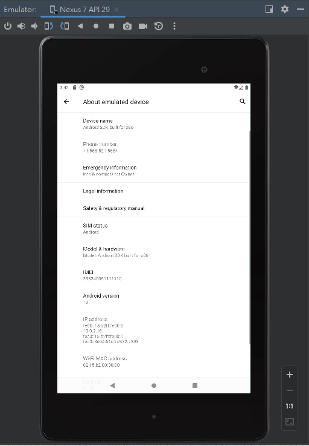
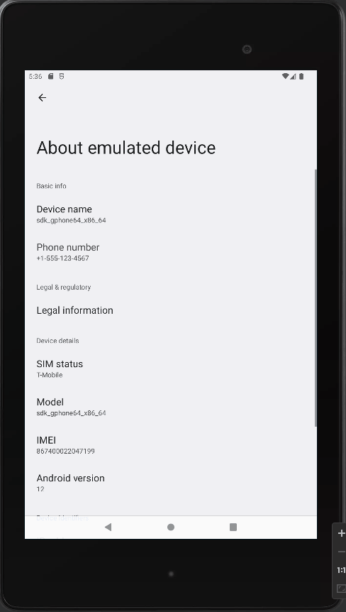

# simple ota client application  
  
A new Android Kotlin project.  
  
## Getting Started  
  
This project is a starting point for a Android Kotlin application.  
  
A few resources to get you started if this is your first Android Kotlin project:  
  
- [Android Basics in Kotlin](https://developer.android.com/courses/android-basics-kotlin/course)  
- [Create your first Android app](https://developer.android.com/courses/pathways/android-basics-kotlin-two)   

## Learn More  
- [View binding](https://developer.android.com/topic/libraries/view-binding#kts)
- [androidx.compose.material](https://developer.android.com/reference/kotlin/androidx/compose/material/package-summary)  
  - [ListItem](https://developer.android.com/reference/kotlin/androidx/compose/material/package-summary#ListItem(androidx.compose.ui.Modifier,kotlin.Function0,kotlin.Function0,kotlin.Boolean,kotlin.Function0,kotlin.Function0,kotlin.Function0))
- [Material Components](https://m2.material.io/components?platform=android)
- [android.widget](https://developer.android.com/reference/android/widget/package-summary)  
  - Interfaces
    - [ExpandableListAdapter](https://developer.android.com/reference/android/widget/ExpandableListAdapter)  
- AndroidManifest.xml documentation:  
  - [android:usesCleartextTraffic](https://developer.android.com/guide/topics/manifest/application-element#usesCleartextTraffic)  
- [okhttp](https://square.github.io/okhttp/)  
- [gson](https://mvnrepository.com/artifact/com.google.code.gson/gson)  
- [Java WebSockets](https://github.com/TooTallNate/Java-WebSocket)  
- [kotlinx.coroutines](https://github.com/Kotlin/kotlinx.coroutines)  
- [Regular FABs](https://m2.material.io/components/buttons-floating-action-button/android#regular-fabs)  
- [Google Fonts Icons](https://fonts.google.com/icons)  
- [Notifications overview](https://developer.android.com/develop/ui/views/notifications), [Create a Notification](https://developer.android.com/develop/ui/views/notifications/build-notification), [Android notifications](https://m2.material.io/design/platform-guidance/android-notifications.html#usage)   
  
## Getting test ota server RESTAPI  
You can run "http://localhost:3000" from the [nodejs-example](https://github.com/yungwenpeng/simple_ota_server)  
  
## Demo  
Android Q  
  
Android S  
  
